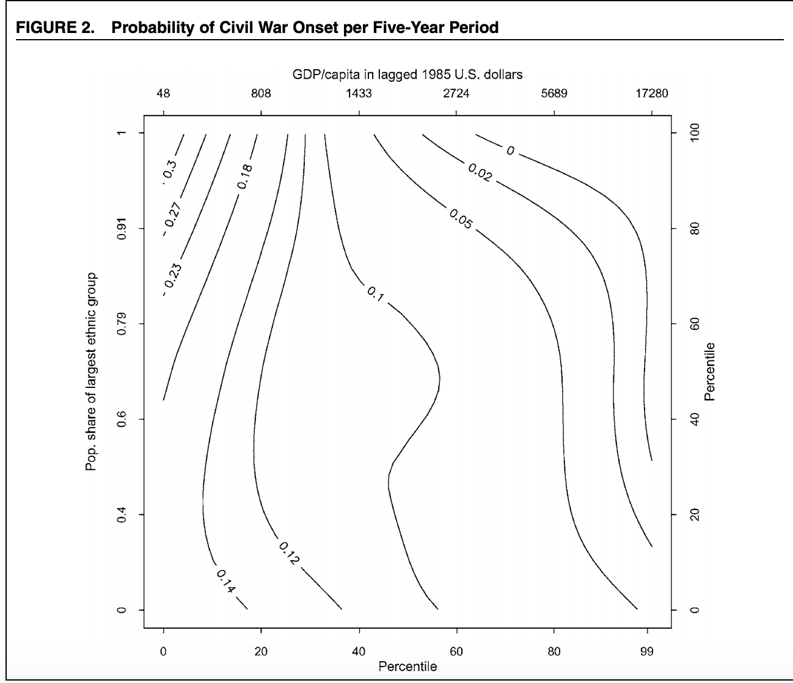

```{r setup, include=FALSE}
library(foreign)
library(tidyverse)
library(dplyr)
library(ggplot2)
library(grid)
library(lubridate)
library(tidyr)
library(broom)
library(scales)
library(ROCR)
library(pROC)
library(e1071)
library(formattable)
library(caret)
library("loo")
library("rstan")
library("rstanarm")
theme_set(theme_bw())

knitr::opts_chunk$set(echo = TRUE)
```

# Paper Overview

Fearon and Laitin analyzed post-WWII global civil wars to see if they could create a model to predict the likelihood of civil war onset. They investigated unique characteristics of the countries at hand to see if they could hypothesize which variable played the biggest role in the making of the civil war. Such as poverty, political instability, ethnic and religious diversity.

They defined civil war as conflicts that meet three criteria: involved fighting between agents of a state and organized nonstate groups who sought to take control of a government policicies, the conflict killed at least 1,000 over its course with at least an average of 100 yearly deaths, and at least 100 were killed on both sides, including civilians attacked by rebels

Eleven hypotheses were were investigated. For example one was: "measures of country's ethnic or religious diversity should be associated with a higher risk of civil war." And most of the other followed suit but with different parameters in the hypothesis.

The paper concluded that there was not enough evidence to conclude that any of the hypothesis were on target and finished with saying that civil wars are incredible hard to predict, but it is easier to predict insurgencies. It includes a cast of doubt on three wide-held notions concerning political conflict findings: prevalence of civil war in the 1990s was not due to the end of the Cold War, greater religious and/or ethnic diversity, on its own does not make a country more prone to civil war, and cannot predict where a civil war will break out - based off of strong ethnic or political grievances. 

# Figures

We seek to replicate the following two figures from the paper. Figure 1 plots the number of countries with ongoing civil wars by year, from 1945 to 1999 (solid line). The paper also shows the proportion of countries with at least one ongoing war in each year (dashed line). What is interesting is that this graph indicates that post-1990s civil wars were not due to the effects of the fall of the Berlin Wall (which signified the end of the Cold War). However, conflicts associated with the fall of the Soviet Union were partly responsible for the sharp increase we witness in the early 1990s. 




# Overview of Data


Their dataset uses data across the world from the period of 1945-1999 on 161 countries that had a population of at least half a million in 1990.

It includes information on the contries: economy, location, population, employment, minerals/resources, civil war information (time frame, deaths, leader, etc.), ethnic onset, oil, GDP, Colonial country, religion percentage, and more. It allows us to explore various parameteres. 
Originally we had used the data as is, but realized that one row had onset==4 so we got rid of it as it seemed to be an anomaly so we got rid of it.

# Conclusions
The paper concludes: "The prevalence of internal war in the 1990s is mainly the result of an accumulation of protracted conflicts since the 1950s rather than a sudden change associated with a new, post-Cold War international system."

The authors of the paper further write that "...the civil wars of the period have structural roots, in the combination of a simple, robust military technology and decolonization, which created an international system numerically dominated by fragile states with limited administrative control of their peripheries." 
Having a poor economy with a bleak future can make joining an insurgency an appealing option for someone who feels they will not have a successful future. So an environment with a weak government that doesn't back up a robust economic system is a good breeding ground for an insurgency. Ethnic diversity on it's own may not necessarily preclude a civil war becuase as long as there are jobs available and the potential to succeed in life, younger people will not see joining a war as an appealing option.


### Our conclusion for the replication of Figures 1&2 
Figure 1 plots the number of ongoing civil wars and percent of countries with civil war over tie (1945 - 1999). This plot was fairly simple to replicate, by grouping by year.

Figure 2 is a contour plot that plots the percentile of countries in civil war versus population fractions of the majority ethnic group and GDP. This plot is very difficult to understand, so we broke it down into 2 plots: one that plots percentile of countries in civil war versus GDP per capita, the other per fraction of the largest ethnicity group. The two plots we produced were actually not that easy to decipher either. This explains why the authors chose a contour plot. 

### Our conclusion for the replication of first column of table 1

Model 1 in Table 1 shows the results of a logit analysis.
using onset as the dependent variable. With a standard glm model we were easily able to recreate column 1 of table 1.

### Our conclusion for the extensions
### By Continent 
[Note: South Africa here refers to the geographic South Africa, not specifically the country South Africa]
The reason we wanted to see how the civil wars broke down by continent is that we could more accurately use a  historical events timeline. So we know that the end of a Cold War was not as important an event as people originally claim. The Cold War ended in ~1991, and you can see from the figure it was in fact South Africa region that has a increase along with Asia, but eastern European actually saw a decrease after that time period. Before 1960 the civil wars was dominated by Asia and Eastern Europe (which historically is accurate). Then the colonial civil wars started to take place (North Africa and Middle East/ South Africa), and consistently played a key role in the overall average of the civil wars in the world.

We can see that a short time after World War II the only two regions that had civil wars were Eastern Europe and Asia, which complety makes sense since Asia was still deveoloping (from colonialism). And Eastern Europe was engulfed by the USSR so there was a tension between the Soviet Union leaders and the satellite states, and by extension the political leaders withing those states, those loyal to the party and those who were not.

We can look at a these conflicts through an economic view. We know that after World War II the victors had an economic growth period called the postwar economic boom starting at 1950 which lasted until early 1970's. So the countries that were involved in the postwar economic boom saw fewer civil wars during that time period. However, 1971 was the collapse of the Bretton Woods Monetary system, then in 1973 there was an oil crisis, followed by the american economic recession from 1973-1975. These events could suggest why we saw a increase in South African and North Africa/Middle East civil wars, as the vestiges of institutional colonialism was fading away and the oil crisis brought a downturn to their economy which drove them to civil wars. This is similar to the political conflicts in European states post WWI, where there was a civil war.

Then with the collapse of the Soviet Union in late 1991 brought some civil wars to East Europe and Asia, but from what we can see it was not a true indicator of civil wars (from the percentages).

We believe that the rise of the South Africa civil wars in the 90's(after the colonial revolutions) was due to mineral resources. Internal conflict was brought up due to different groups of a recently developed country fighting for minerals in order to get money. 

### Predictability of model 

We dropped one Russia becase it was the only country whose onset (which is what the paper is trying to predict on) is not 0 or 1. 


# Figure 1 Replication


```{r figure-1-replication}
repdata <- read.dta("./data/repdata.dta")
# removing onset == 4
repdata <-repdata[-2496, ]

glance(repdata)
# View(repdata)

sumwars_per_year <- repdata %>%
  group_by(year) %>%
  filter(war == 1) %>%
  summarize(
    count_wars_total = sum(wars)
  )

wars_per_year <- repdata %>%
  group_by(year) %>%
  filter(war == 1) %>%
  summarize(
    count_wars = sum(war)
  )

raw_num_countries <- repdata %>%
  group_by(year) %>%
  summarize(
    count_countries = sum(n())
  ) %>%
  ungroup(year)

perc_civil_war <- merge(wars_per_year, raw_num_countries, by = "year")
perc_civil_war <- merge(perc_civil_war, sumwars_per_year, by = "year")

# View(perc_civil_war)

perc_civil_war$perc <- (perc_civil_war$count_wars/perc_civil_war$count_countries)*100

plot(perc_civil_war$year, perc_civil_war$count_wars_total, axes = FALSE,
     ylim = c(0, 50), xlab = "", ylab = "", type = "l", 
     col = "blue", main = "# and % of Countries with Ongoing Civil Wars (1945-1999)")
axis(2, ylim = c(0, 50), col = "black", las = 1)
mtext("# Ongoing Wars", side = 2, col = "black", line = 2.5)

# Plot the second plot and draw the axis on the right 
par(new = TRUE)
plot(perc_civil_war$year, perc_civil_war$perc, pch = "solid", xlab = "", ylab = "", ylim = c(0, 30), axes = FALSE, type = "l", lty = 2, col = "red")
mtext("% Countries with a Civil War", side = 4, col = "black", line = 2.5)
axis(4, ylim = c(0, 30), col = "black", col.axis = "black")

# Draw the time axis
axis(1, pretty(range(perc_civil_war$year), 4))
mtext("Year", side = 1, col = "black", line = 2.5)

# Draw the legend
legend("topleft", legend = c("# civil wars", "% with civil war"), 
       text.col = c("blue", "red"), col = c("blue", "red"), lty = 1:2, cex = 0.7)
```

# Figure 2 Replication: Part A

```{r figure-2-replication-part-a}

gdp_per_year <- repdata %>%
  drop_na(gdpen) %>%
  drop_na(pop) %>%
  group_by(year) %>%
  summarize(
    gdp_sum = sum(gdpen),
    pop_sum = sum(pop)
  )

gdp_per_year$gdp_pc <- gdp_per_year$gdp_sum / gdp_per_year$pop_sum * 10000

gdp_per_year_perc <- merge(gdp_per_year, perc_civil_war, by = "year")
gdp_per_year_perc$cv_percentile <- round(gdp_per_year_perc$perc / max(gdp_per_year_perc$perc), digits = 4)

# View(gdp_per_year_perc)

gdp_per_year_perc %>%
  ggplot(aes(x = perc, y = gdp_pc)) +
  geom_line(color = "red")

```

# Figure 2 Replication: Part B

```{r figure-2-replication-part-b}

rep_data_eth <- repdata %>%
  select(ethfrac, war) %>%
  mutate(ethfrac_rounded = round(ethfrac, digits = 1)) %>%
  group_by(ethfrac_rounded) %>%
  summarize(
    sum_countries = sum(n()),
    sumwars_per_eth = sum(war)
  )

rep_data_eth$war_perc = rep_data_eth$sumwars_per_eth/rep_data_eth$sum_countries

# View(rep_data_eth)

rep_data_eth %>%
  ggplot(aes(x = war_perc, y = ethfrac_rounded)) +
  geom_line(color = "blue")


```


# Replicating column 1 of table 1

```{r table-1-first-column-replication}

# using everything the paper does for table 1
mylogit1 <- glm(onset ~ warl + gdpenl + lpopl1 + lmtnest
+ ncontig + Oil + nwstate + instab + polity2l + ethfrac + relfrac,  data =repdata, family = "binomial")
summary(mylogit1)
# removing gdp
mylogit2<- glm(onset ~ warl  + lpopl1 + lmtnest
+ ncontig + Oil + nwstate + instab + polity2l + ethfrac + relfrac,  data =repdata, family = "binomial")
summary(mylogit2)
# removing ethfrac
mylogit3 <- glm(onset ~ warl  + gdpenl + lpopl1 + lmtnest
+ ncontig + Oil + nwstate + instab + polity2l +  relfrac,  data =repdata, family = "binomial")
summary(mylogit3)

```


### Analysis using Stan and Loo
```{r using stan to reproduce table 1}
# using everything the paper does for table 1
# resource https://uw-csss-564.github.io/assignment-2017-4//
#mylogit1_stan <- stan_glm(onset ~ warl + gdpenl + lpopl1 + lmtnest
#+ ncontig + Oil + nwstate + instab + polity2l + ethfrac + relfrac,  data =repdata, family = "binomial")
#summary(mylogit1)
# removing gdp
#mylogit2_stan<- stan_glm(onset ~ warl  + lpopl1 + lmtnest
#+ ncontig + Oil + nwstate + instab + polity2l + ethfrac + relfrac,  data =repdata, family = "binomial")
#summary(mylogit2)

# Leave-One-Out (LOO) cross-validation, which is implemented by the loo function in the loo package

#loo_mod1 <- loo(mylogit1_stan)
#loo_mod2 <- loo(mylogit2_stan)
#compare(loo_mod1,loo_mod2)
```
It took too long to run, so we commented it out becuase we kept on having to run our code. But it does show that the model that doesn't have gdp is slightly worse, which is of course expeced.


### Some more validations on the logit model
```{r validating logit model}
data(repdata)
Train <- createDataPartition(repdata$onset, p=0.6, list=FALSE)
training <- repdata[ Train, ]
testing <- repdata[ -Train, ]

mylogit1_test <- glm(as.factor(onset) ~ warl  + lpopl1 + lmtnest
+ ncontig + Oil + nwstate + instab + polity2l + ethfrac + relfrac,  data = training,family = "binomial")
mylogit1_train_pred  <- predict(mylogit1_test, data=training,type="response")
head(mylogit1_train_pred)
mylogit1_test_pred <- predict(mylogit1_test, data=testing,type="response")
head(mylogit1_test_pred)
log_odds = predict(mylogit1, testing)

```

### conclusion for the replication of first column of table 1 
Model 1 in Table 1 shows the results of a logit analysis
using onset as the dependent variable. 


# Extensions


```{r paper-extension civil war by region}

#First five lines filter the oringal data (repdata) and such that we create the total number of civil wars,
#then the number of wars per year
# then just the number of countries, 
#from this we can create the perc_civil_war where it is the same as figure2


sumwars_per_year <- repdata %>%
  group_by(year) %>%
  filter(war == 1) %>%
  summarize(
    count_wars_total = sum(wars)
  )

wars_per_year <- repdata %>%
  group_by(year) %>%
  filter(war == 1) %>%
  summarize(
    count_wars = sum(war)
  )

raw_num_countries <- repdata %>%
  group_by(year) %>%
  summarize(
    count_countries = sum(n())
  ) %>%
  ungroup(year)

perc_civil_war <- merge(wars_per_year, raw_num_countries, by = "year")
perc_civil_war <- merge(perc_civil_war, sumwars_per_year, by = "year")

#We then want to filter the original by region: South America, Western, East Europe, 
#South Africa, Asia, and North Africa/Middle East
#Then take the total of civil wars per for each region
# then normalize them as percents by dividing each by the perc_civil_war from above


#South America
southamerica <- repdata  %>% filter (lamerica == 1) 
wars_per_year_SA <- southamerica %>% group_by( year) %>% summarize(count_wars = sum(war))
percent_SA <- (wars_per_year_SA$count_wars/perc_civil_war$count_wars)

#Western
western <- repdata %>% filter (western == 1)
wars_per_year_WS <- western %>% group_by(year)  %>% summarize(count_wars = sum(war))
percent_WS <- (wars_per_year_WS$count_wars/perc_civil_war$count_wars)

#East Europe
easteurope <- repdata  %>% filter (eeurop == 1) 
wars_per_year_EE <- easteurope %>% group_by(year)  %>% summarize(count_wars = sum(war))
percent_EE <- (wars_per_year_SA$count_wars/perc_civil_war$count_wars)

#South Africa
southafrica <- repdata  %>% filter (ssafrica == 1) 
wars_per_year_SAF <- southafrica%>% group_by(year)  %>% summarize(count_wars = sum(war))
percent_SAF <- (wars_per_year_SAF$count_wars/perc_civil_war$count_wars)

#Asia
asia <- repdata  %>% filter (asia == 1)
wars_per_year_AS <- asia %>% group_by(year) %>% summarize(count_wars = sum(war))
percent_AS <- (wars_per_year_AS$count_wars/perc_civil_war$count_wars)

#North African and Middle East
northafricamiddleeast <- repdata %>% filter (nafrme == 1) 
wars_per_year_NAM <- northafricamiddleeast %>% group_by(year) %>% summarize(count_wars = sum(war)) 
percent_NAM <- (wars_per_year_NAM$count_wars/perc_civil_war$count_wars)


#Plot each continent percent civil war on same plot to show differences
plot(wars_per_year_SA$year, percent_SA, axes = FALSE,
     ylim = c(0, 1), xlim = c(1945, 2000), xlab = "" , ylab = "", type = "l", 
     col = "purple", main = "% of Civil Wars by Continent (1945-1999)")
lines(wars_per_year_WS$year, percent_WS, col = "green")
lines(wars_per_year_EE$year, percent_EE, col = "coral")
lines(wars_per_year_SAF$year, percent_SAF, col = "blue")
lines(wars_per_year_AS$year, percent_AS, col = "red")
lines(wars_per_year_NAM$year, percent_NAM, col = "black")

#Label plot x/y axis
axis(2, ylim = c(0, 1), col = "black", las = 1)
axis(1, xlim = c(1945, 1999), col = "black", las = 1)
mtext("Percent ", side = 2, col = "black", line = 2.5)
mtext("Year", side = 1, col = "black", line = 2.5)

#Give a legend to plot for each continent
legend("topright", legend = c("South America", "North America & Western Europe", "Eastern Europe","South Africa", "Asia", "North Africa & Middle East" ), text.col = c("purple", "green", "coral", "blue", "red", "black"), col = c("purple", "green", "coral", "blue", "red", "black"), lty = 1:2, cex = 0.5)

#We wanted to see each country that had a civil war in each continent and then the time frame for it

#we filtered by country and year looking countries that had civil wars
#ordered it by year, then use ave/paste0  to find the time frame of each civil 
#then took away duplicates
#Its important to note that if a country had multiple civil wars over various time frames, we took the date of the first
#and the end date of the last for the time frames. This is because there was still internal disruptionduring the "off" years
#Which is why Russia is shown as 1946-1999, becasue they had their internal disputes early on 1946-1950, then was a part of the Cold War,
#up until the contry fell of which the 1992-1999 civil wars started

#South America
wars_country_year_SA <- southamerica %>% group_by(country,year) %>% filter(war==1 )%>% summarize(Year = year)
wars_country_year_SA <- wars_country_year_SA [order(wars_country_year_SA$Year),]
wars_country_year_SA$min = ave(wars_country_year_SA$Year, wars_country_year_SA$country, FUN = min)
wars_country_year_SA$max = ave(wars_country_year_SA$Year, wars_country_year_SA$country, FUN = max)
wars_country_year_SA$range = paste0(wars_country_year_SA$min, " - ", wars_country_year_SA$max)
wars_country_year_SA = wars_country_year_SA[!duplicated(wars_country_year_SA$country),]
wars_country_year_SA <- wars_country_year_SA[,c(1,6)]
names(wars_country_year_SA) <- c("South America", "Conflict Time Frame")


#Western Countries
wars_country_year_W <- western %>% group_by(country,year) %>% filter(war==1 )%>% summarize(Year = year)
wars_country_year_W <- wars_country_year_W [order(wars_country_year_W$Year),]
wars_country_year_W$min = ave(wars_country_year_W$Year, wars_country_year_W$country, FUN = min)
wars_country_year_W$max = ave(wars_country_year_W$Year, wars_country_year_W$country, FUN = max)
wars_country_year_W$range = paste0(wars_country_year_W$min, " - ", wars_country_year_W$max)
wars_country_year_W = wars_country_year_W[!duplicated(wars_country_year_W$country),]
wars_country_year_W <- wars_country_year_W[,c(1,6)]
names(wars_country_year_W) <- c("Western Countries", "Conflict Time Frame")


#East Europe
wars_country_year_EE <- easteurope %>% group_by(country,year) %>% filter(war==1 )%>% summarize(Year = year)
wars_country_year_EE <- wars_country_year_EE [order(wars_country_year_EE$Year),]
wars_country_year_EE$min = ave(wars_country_year_EE$Year, wars_country_year_EE$country, FUN = min)
wars_country_year_EE$max = ave(wars_country_year_EE$Year, wars_country_year_EE$country, FUN = max)
wars_country_year_EE$range = paste0(wars_country_year_EE$min, " - ", wars_country_year_EE$max)
wars_country_year_EE = wars_country_year_EE[!duplicated(wars_country_year_EE$country),]
wars_country_year_EE <- wars_country_year_EE[,c(1,6)]
names(wars_country_year_EE) <- c("East Europe", "Conflict Time Frame")


#South Africa
wars_country_year_SAF <- southafrica %>% group_by(country,year) %>% filter(war==1 )%>% summarize(Year = year)
wars_country_year_SAF <- wars_country_year_SAF [order(wars_country_year_SAF$Year),]
wars_country_year_SAF$min = ave(wars_country_year_SAF$Year, wars_country_year_SAF$country, FUN = min)
wars_country_year_SAF$max = ave(wars_country_year_SAF$Year, wars_country_year_SAF$country, FUN = max)
wars_country_year_SAF$range = paste0(wars_country_year_SAF$min, " - ", wars_country_year_SAF$max)
wars_country_year_SAF = wars_country_year_SAF[!duplicated(wars_country_year_SAF$country),]
wars_country_year_SAF <- wars_country_year_SAF[,c(1,6)]
names(wars_country_year_SAF) <- c("South Africa", "Conflict Time Frame")


#Asia
wars_country_year_A <- asia %>% group_by(country,year) %>% filter(war==1 )%>% summarize(Year = year)
wars_country_year_A <- wars_country_year_A [order(wars_country_year_A$Year),]
wars_country_year_A$min = ave(wars_country_year_A$Year, wars_country_year_A$country, FUN = min)
wars_country_year_A$max = ave(wars_country_year_A$Year, wars_country_year_A$country, FUN = max)
wars_country_year_A$range = paste0(wars_country_year_A$min, " - ", wars_country_year_A$max)
wars_country_year_A = wars_country_year_A[!duplicated(wars_country_year_A$country),]
wars_country_year_A <- wars_country_year_A[,c(1,6)]
names(wars_country_year_A) <- c("Asia", "Conflict Time Frame")


#North Africa and Middle East
wars_country_year_NA <- northafricamiddleeast %>% group_by(country,year) %>% filter(war==1 )%>% summarize(Year = year)
wars_country_year_NA <- wars_country_year_NA [order(wars_country_year_NA$Year),]
wars_country_year_NA$min = ave(wars_country_year_NA$Year, wars_country_year_NA$country, FUN = min)
wars_country_year_NA$max = ave(wars_country_year_NA$Year, wars_country_year_NA$country, FUN = max)
wars_country_year_NA$range = paste0(wars_country_year_NA$min, " - ", wars_country_year_NA$max)
wars_country_year_NA = wars_country_year_NA[!duplicated(wars_country_year_NA$country),]
wars_country_year_NA <- wars_country_year_NA[,c(1,6)]
names(wars_country_year_NA) <- c("North Africa and Middle East", "Conflict Time Frame")


#Prints all tables for the Region

table(wars_country_year_SA)
table(wars_country_year_W)
table(wars_country_year_EE)
table(wars_country_year_NA)
table (wars_country_year_SAF)
table (wars_country_year_A)
table (wars_country_year_NA)
```

```{r paper-extension-acc-pred}

repdata <- repdata %>% group_by(war) %>% mutate(outcome = ifelse(war == 1 ,'civil_war','no_war'))
repdata$outcome <- as.factor(repdata$outcome)
# View(repdata)

set.seed(42)
ndx <- sample(nrow(repdata), floor(nrow(repdata) * 0.9))
train <- repdata[ndx,]
test <- repdata[-ndx,]

xTrain <- train[,-70]
yTrain <- train$outcome

xTest <- test[,-70]
yTest <- test$outcome

# model <- naiveBayes(xTrain, yTrain)
# summary(model)

model1 <- naiveBayes(outcome ~ warl + lpopl1 + lmtnest
+ ncontig + nwstate + instab + polity2l + ethfrac + relfrac,  data = train, family = "binomial")
summary(model1)

df1 <- data.frame(actual = yTest, pred = predict(model1, test))

head(df1)

table(df1)

# accuracy: fraction of correct classifications
df1 %>%
  summarize(acc = mean(pred == actual))

# precision: fraction of positive predictions that are actually true
df1 %>%
  filter(pred == 'civil_war') %>%
  summarize(prec = mean(actual == 'civil_war'))

# recall: fraction of true examples that we predicted to be positive
# aka true positive rate, sensitivity
df1 %>%
  filter(actual == 'civil_war') %>%
  summarize(recall = mean(pred == 'civil_war'))

# false positive rate: fraction of false examples that we predicted to be positive
df1 %>%
  filter(actual == 'no_war') %>%
  summarize(fpr = mean(pred == 'civil_war'))

# plot histogram of predicted probabilities
# note overconfident predictions
probs1 <- data.frame(predict(model1, test, type="raw"))

ggplot(probs1, aes(x = civil_war)) +
  geom_histogram(binwidth = 0.01) +
  scale_x_continuous(label = percent) +
  xlab('Predicted probability of civil war') +
  ylab('Number of examples')

data.frame(predicted=probs1[, "civil_war"], actual=yTest) %>%
  group_by(predicted=round(predicted*10)/10) %>%
  summarize(num=n(), actual=mean(actual == "civil_war")) %>%
  ggplot(data=., aes(x=predicted, y=actual, size=num)) +
  geom_point() +
  geom_abline(linetype=2) +
  scale_x_continuous(labels=percent, lim=c(0,1)) +
  scale_y_continuous(labels=percent, lim=c(0,1)) +
  xlab('Predicted probability of civil war') +
  ylab('Percent that are actually civil war')

# create a ROCR object
pred1 <- prediction(probs1[, "civil_war"], yTest)

# create a ROCR object
pred1 <- prediction(probs1[, "civil_war"], yTest)

# plot ROC curve
perf_nb1 <- performance(pred1, measure='tpr', x.measure='fpr')
plot(perf_nb1)
performance(pred1, 'auc')

```

```{r remove-oil-gdp}

model1 <- naiveBayes(outcome ~ warl + lpopl1 + lmtnest
+ ncontig + nwstate + instab + polity2l + ethfrac + relfrac,  data = train, family = "binomial")
summary(model1)

df1 <- data.frame(actual = yTest, pred = predict(model1, test))

head(df1)

table(df1)

# accuracy: fraction of correct classifications
df1 %>%
  summarize(acc = mean(pred == actual))

# precision: fraction of positive predictions that are actually true
df1 %>%
  filter(pred == 'civil_war') %>%
  summarize(prec = mean(actual == 'civil_war'))

# recall: fraction of true examples that we predicted to be positive
# aka true positive rate, sensitivity
df1 %>%
  filter(actual == 'civil_war') %>%
  summarize(recall = mean(pred == 'civil_war'))

# false positive rate: fraction of false examples that we predicted to be positive
df1 %>%
  filter(actual == 'no_war') %>%
  summarize(fpr = mean(pred == 'civil_war'))

# plot histogram of predicted probabilities
# note overconfident predictions
probs1 <- data.frame(predict(model1, test, type="raw"))

ggplot(probs1, aes(x = civil_war)) +
  geom_histogram(binwidth = 0.01) +
  scale_x_continuous(label = percent) +
  xlab('Predicted probability of civil war') +
  ylab('Number of examples')

data.frame(predicted=probs1[, "civil_war"], actual=yTest) %>%
  group_by(predicted=round(predicted*10)/10) %>%
  summarize(num=n(), actual=mean(actual == "civil_war")) %>%
  ggplot(data=., aes(x=predicted, y=actual, size=num)) +
  geom_point() +
  geom_abline(linetype=2) +
  scale_x_continuous(labels=percent, lim=c(0,1)) +
  scale_y_continuous(labels=percent, lim=c(0,1)) +
  xlab('Predicted probability of civil war') +
  ylab('Percent that are actually civil war')

# create a ROCR object
pred1 <- prediction(probs1[, "civil_war"], yTest)

# create a ROCR object
pred1 <- prediction(probs1[, "civil_war"], yTest)

# plot ROC curve
perf_nb1 <- performance(pred1, measure='tpr', x.measure='fpr')
plot(perf_nb1)
performance(pred1, 'auc')

```

```{r keep-one-factor}

model2 <- naiveBayes(outcome ~ instab ,  data = train, family = "binomial")
summary(model2)

df2 <- data.frame(actual = yTest, pred = predict(model2, test))

head(df2)

table(df2)

# accuracy: fraction of correct classifications
df2 %>%
  summarize(acc = mean(pred == actual))

# precision: fraction of positive predictions that are actually true
df2 %>%
  filter(pred == 'civil_war') %>%
  summarize(prec = mean(actual == 'civil_war'))

# recall: fraction of true examples that we predicted to be positive
# aka true positive rate, sensitivity
df2 %>%
  filter(actual == 'civil_war') %>%
  summarize(recall = mean(pred == 'civil_war'))

# false positive rate: fraction of false examples that we predicted to be positive
df2 %>%
  filter(actual == 'no_war') %>%
  summarize(fpr = mean(pred == 'civil_war'))

# plot histogram of predicted probabilities
# note overconfident predictions
probs2 <- data.frame(predict(model2, test, type="raw"))

ggplot(probs2, aes(x = civil_war)) +
  geom_histogram(binwidth = 0.01) +
  scale_x_continuous(label = percent) +
  xlab('Predicted probability of civil war') +
  ylab('Number of examples')

data.frame(predicted=probs2[, "civil_war"], actual=yTest) %>%
  group_by(predicted=round(predicted*10)/10) %>%
  summarize(num=n(), actual=mean(actual == "civil_war")) %>%
  ggplot(data=., aes(x=predicted, y=actual, size=num)) +
  geom_point() +
  geom_abline(linetype=2) +
  scale_x_continuous(labels=percent, lim=c(0,1)) +
  scale_y_continuous(labels=percent, lim=c(0,1)) +
  xlab('Predicted probability of civil war') +
  ylab('Percent that are actually civil war')

# create a ROCR object
pred2 <- prediction(probs2[, "civil_war"], yTest)

# create a ROCR object
pred2 <- prediction(probs2[, "civil_war"], yTest)

# plot ROC curve
perf_nb2 <- performance(pred2, measure='tpr', x.measure='fpr')
plot(perf_nb2)
performance(pred2, 'auc')

```

```{r}
sessionInfo()
```
