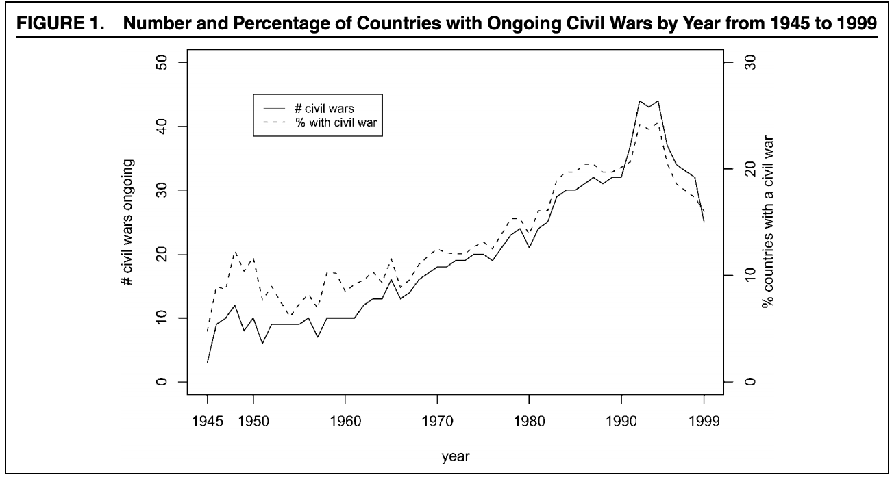

```{r setup, include=FALSE}
library(foreign)
library(tidyverse)
library(dplyr)
library(ggplot2)
library(grid)
library(lubridate)
library(tidyr)
library(broom)
library(scales)
library(ROCR)
library(pROC)
library(e1071)

theme_set(theme_bw())

knitr::opts_chunk$set(echo = TRUE)
```

# Paper Overview

Fearon and Laitin analyzed post-WWII global civil wars to see if they could create a model to predict the likelihood of civil war onset. They investigated unique characteristics of the countries at hand to see if they could hypothesize which variable played the biggest role in the making of the civil war. Such as poverty, political instability, ethnic and religious diversity.

They defined civil war as conflicts that meet three criteria: involved fighting between agents of a state and organized nonstate groups who sought to take control of a government policicies, the conflict killed at least 1,000 over its course with at least an average of 100 yearly deaths, and at least 100 were killed on both sides, including civilians attacked by rebels

Eleven hypotheses were were investigated. For example one was: "measures of country's ethnic or religious diversity should be associated with a higher risk of civil war." And most of the other followed suit but with different parameters in the hypothesis. 

The paper concluded that there was not enough evidence to conclude that any of the hypothesis were on target and finished with saying that civil wars are incredible hard to predict, but it is easier to predict insurgencies. It includes a cast of doubt on three wide-held notions concerning political conflict findings: prevalence of civil war in the 1990s was not due to the end of the Cold War, greater religious and/or ethnic diversity, on its own does not make a country more prone to civil war, and cannot predict where a civil war will break out - based off of strong ethnic or political grievances. 

# Figures

We seek to replicate the following two figures from the paper. Figure 1 plots the number of countries with ongoing civil wars by year, from 1945 to 1999 (solid line). The paper also shows the proportion of countries with at least one ongoing war in each year (dashed line). What is interesting is that this graph indicates that post-1990s civil wars were not due to the effects of the fall of the Berlin Wall (which signified the end of the Cold War). However, conflicts associated with the fall of the Soviet Union were partly responsible for the sharp increase we witness in the early 1990s. 




# Overview of Data


Their dataset uses data across the world from the period of 1945-1999 on 161 countries that had a population of at least hal a million in 1990.

It includes information on the contries: economy, location, population, employment, minerals/resources, civil war information (time frame, deaths, leader, etc.), ethnic onset, oil, GDP, Colonial country, religion percentage, and more. It allows us to explore various parameteres. 


# Conclusions


# Our conclusion for the replication of Figures 1&2 (AYSHA)
# Our conclusion for the replication of first column of table 1 (CHAIM)
# Our conclusion for the extensions
# - by contenent - 
The reason we wanted to see how the civil wars broke down by continent is that we could more accurately use a  historical events timeline. So we know that the end of a Cold War was not a as important event as people originally claims. The Cold War ended in 1991, ans you can see from the figure it was in fact South Africa region that has a increase along with Asia, but eastern European actually saw a decrease after that time period. Before 1960 the civil wars was dominated by Asia and Eastern Europe (which historically is accurate). Then the colonial civil wars started to take place (North Africa and Middle East/ South Africa), and consistently played a key rile in the overall average of the civil wars in the world.

# - predictibility of model - 


# Figure 1 Replicatiion


```{r figure-1-replication}
repdata <- read.dta("./data/repdata.dta")

glance(repdata)
# View(repdata)

sumwars_per_year <- repdata %>%
  group_by(year) %>%
  filter(war == 1) %>%
  summarize(
    count_wars_total = sum(wars)
  )

wars_per_year <- repdata %>%
  group_by(year) %>%
  filter(war == 1) %>%
  summarize(
    count_wars = sum(war)
  )

raw_num_countries <- repdata %>%
  group_by(year) %>%
  summarize(
    count_countries = sum(n())
  ) %>%
  ungroup(year)

perc_civil_war <- merge(wars_per_year, raw_num_countries, by = "year")
perc_civil_war <- merge(perc_civil_war, sumwars_per_year, by = "year")

# View(perc_civil_war)

perc_civil_war$perc <- (perc_civil_war$count_wars/perc_civil_war$count_countries)*100

plot(perc_civil_war$year, perc_civil_war$count_wars_total, axes = FALSE,
     ylim = c(0, 50), xlab = "", ylab = "", type = "l", 
     col = "blue", main = "# and % of Countries with Ongoing Civil Wars (1945-1999)")
axis(2, ylim = c(0, 50), col = "black", las = 1)
mtext("# Ongoing Wars", side = 2, col = "black", line = 2.5)

# Plot the second plot and draw the axis on the right 
par(new = TRUE)
plot(perc_civil_war$year, perc_civil_war$perc, pch = "solid", xlab = "", ylab = "", ylim = c(0, 30), axes = FALSE, type = "l", lty = 2, col = "red")
mtext("% Countries with a Civil War", side = 4, col = "black", line = 2.5)
axis(4, ylim = c(0, 30), col = "black", col.axis = "black")

# Draw the time axis
axis(1, pretty(range(perc_civil_war$year), 4))
mtext("Year", side = 1, col = "black", line = 2.5)

# Draw the legend
legend("topleft", legend = c("# civil wars", "% with civil war"), 
       text.col = c("blue", "red"), col = c("blue", "red"), lty = 1:2, cex = 0.7)
```

# Figure 2 Replication: Part A

```{r figure-2-replication-part-a}

gdp_per_year <- repdata %>%
  drop_na(gdpen) %>%
  drop_na(pop) %>%
  group_by(year) %>%
  summarize(
    gdp_sum = sum(gdpen),
    pop_sum = sum(pop)
  )

gdp_per_year$gdp_pc <- gdp_per_year$gdp_sum / gdp_per_year$pop_sum * 10000

gdp_per_year_perc <- merge(gdp_per_year, perc_civil_war, by = "year")
gdp_per_year_perc$cv_percentile <- round(gdp_per_year_perc$perc / max(gdp_per_year_perc$perc), digits = 4)

# View(gdp_per_year_perc)

gdp_per_year_perc %>%
  ggplot(aes(x = perc, y = gdp_pc)) +
  geom_line(color = "red")

```

# Figure 2 Replication: Part B

```{r figure-2-replication-part-b}

rep_data_eth <- repdata %>%
  select(ethfrac, war) %>%
  mutate(ethfrac_rounded = round(ethfrac, digits = 1)) %>%
  group_by(ethfrac_rounded) %>%
  summarize(
    sum_countries = sum(n()),
    sumwars_per_eth = sum(war)
  )

rep_data_eth$war_perc = rep_data_eth$sumwars_per_eth/rep_data_eth$sum_countries

# View(rep_data_eth)

rep_data_eth %>%
  ggplot(aes(x = war_perc, y = ethfrac_rounded)) +
  geom_line(color = "blue")


```

```{r table-1-first-column-replication}

mylogit <- glm(as.factor(onset) ~ warl + gdpenl + lpopl1 + lmtnest
+ ncontig + Oil + nwstate + instab + polity2l + ethfrac + relfrac,  data =repdata, family = "binomial")
summary(mylogit)

```

# Extensions

```{r paper-extension civil war by continent}
sumwars_per_year <- repdata %>% group_by(year) %>% filter(war == 1) %>%summarize(count_wars_total = sum(wars))

wars_per_year <- repdata %>% group_by(year) %>%filter(war == 1) %>%summarize(count_wars = sum(war))

raw_num_countries <- repdata %>% group_by(year) %>% summarize(count_countries = sum(n())) %>%ungroup(year)

perc_civil_war <- merge(wars_per_year, raw_num_countries, by = "year")
perc_civil_war <- merge(perc_civil_war, sumwars_per_year, by = "year")
#perc_civil_war$perc <- (perc_civil_war$count_wars/perc_civil_war$count_countries)*100

southamerica <- repdata  %>% 
  filter (lamerica == 1)

wars_per_year_SA <- southamerica %>% group_by(year) %>%
  summarize(count_wars = sum(war))

percent_SA <- (wars_per_year_SA$count_wars/perc_civil_war$count_wars)
plot(wars_per_year_SA$year, percent_SA, axes = FALSE,
     ylim = c(0, 1), xlim = c(1945, 2000), xlab = "" , ylab = "", type = "l", 
     col = "purple", main = "% of Civil Wars by Continent (1945-1999)")

western <- repdata %>% filter (western == 1)
wars_per_year_WS <- western %>% group_by(year)  %>% summarize(count_wars = sum(war))
percent_WS <- (wars_per_year_WS$count_wars/perc_civil_war$count_wars)
lines(wars_per_year_WS$year, percent_WS, col = "green")

easteurope <- repdata  %>% filter (eeurop == 1)
wars_per_year_EE <- easteurope %>% group_by(year)  %>% summarize(count_wars = sum(war))
percent_EE <- (wars_per_year_SA$count_wars/perc_civil_war$count_wars)
lines(wars_per_year_EE$year, percent_EE, col = "coral")

southafrica <- repdata  %>% filter (ssafrica == 1)
wars_per_year_SAF <- southafrica%>% group_by(year)  %>% summarize(count_wars = sum(war))
percent_SAF <- (wars_per_year_SAF$count_wars/perc_civil_war$count_wars)
lines(wars_per_year_SAF$year, percent_SAF, col = "blue")

asia <- repdata  %>% filter (asia == 1)
wars_per_year_AS <- asia %>% group_by(year)  %>% summarize(count_wars = sum(war))
percent_AS <- (wars_per_year_AS$count_wars/perc_civil_war$count_wars)
lines(wars_per_year_AS$year, percent_AS, col = "red")

northafricamiddleeast <- repdata %>% filter (nafrme == 1)
wars_per_year_NAM <- northafricamiddleeast %>% group_by(year)  %>% summarize(count_wars = sum(war))
percent_NAM <- (wars_per_year_NAM$count_wars/perc_civil_war$count_wars)
lines(wars_per_year_NAM$year, percent_NAM, col = "black")

#sumwars_per_year <- repdata %>% group_by(year) %>% filter(war == 1) %>% summarize(count_wars = sum(wars) )
#lines(sumwars_per_year$year, sumwars_per_year$count_wars, col = "darkgreen")

axis(2, ylim = c(0, 1), col = "black", las = 1)
axis(1, xlim = c(1945, 1999), col = "black", las = 1)
mtext("Percent ", side = 2, col = "black", line = 2.5)
mtext("Year", side = 1, col = "black", line = 2.5)
#legend("topleft", legend = c("South America", "North America & Western Europe", "Eastern Europe","South Africa", "Asia", "North Africa & Middle East", "Total # of Civil Wars" ), 
#text.col = c("purple", "green", "coral", "blue", "red", "orange", "darkgreen"), col = c("purple", "green", "coral", "blue", "red", "orange", "darkgreen"), lty = 1:2, cex = 0.5)
legend("topright", legend = c("South America", "North America & Western Europe", "Eastern Europe","South Africa", "Asia", "North Africa & Middle East" ), 
       text.col = c("purple", "green", "coral", "blue", "red", "black"), col = c("purple", "green", "coral", "blue", "red", "black"), lty = 1:2, cex = 0.5)

```

```{r paper-extension-acc-pred}

repdata <- repdata %>% group_by(war) %>% mutate(outcome = ifelse(war == 1 ,'civil_war','no_war'))
repdata$outcome <- as.factor(repdata$outcome)
# View(repdata)

set.seed(42)
ndx <- sample(nrow(repdata), floor(nrow(repdata) * 0.9))
train <- repdata[ndx,]
test <- repdata[-ndx,]

xTrain <- train[,-70]
yTrain <- train$outcome

xTest <- test[,-70]
yTest <- test$outcome

# model <- naiveBayes(xTrain, yTrain)
# summary(model)

model <- naiveBayes(outcome ~ warl + gdpenl + lpopl1 + lmtnest
+ ncontig + Oil + nwstate + instab + polity2l + ethfrac + relfrac,  data = train, family = "binomial")
summary(model)

df <- data.frame(actual = yTest, pred = predict(model, test))

head(df)

table(df)

# accuracy: fraction of correct classifications
df %>%
  summarize(acc = mean(pred == actual))

# precision: fraction of positive predictions that are actually true
df %>%
  filter(pred == 'civil_war') %>%
  summarize(prec = mean(actual == 'civil_war'))

# recall: fraction of true examples that we predicted to be positive
# aka true positive rate, sensitivity
df %>%
  filter(actual == 'civil_war') %>%
  summarize(recall = mean(pred == 'civil_war'))

# false positive rate: fraction of false examples that we predicted to be positive
df %>%
  filter(actual == 'no_war') %>%
  summarize(fpr = mean(pred == 'civil_war'))

# plot histogram of predicted probabilities
# note overconfident predictions
probs <- data.frame(predict(model, test, type="raw"))

ggplot(probs, aes(x = civil_war)) +
  geom_histogram(binwidth = 0.01) +
  scale_x_continuous(label = percent) +
  xlab('Predicted probability of civil war') +
  ylab('Number of examples')

data.frame(predicted=probs[, "civil_war"], actual=yTest) %>%
  group_by(predicted=round(predicted*10)/10) %>%
  summarize(num=n(), actual=mean(actual == "civil_war")) %>%
  ggplot(data=., aes(x=predicted, y=actual, size=num)) +
  geom_point() +
  geom_abline(linetype=2) +
  scale_x_continuous(labels=percent, lim=c(0,1)) +
  scale_y_continuous(labels=percent, lim=c(0,1)) +
  xlab('Predicted probability of civil war') +
  ylab('Percent that are actually civil war')

# create a ROCR object
pred <- prediction(probs[, "civil_war"], yTest)

# create a ROCR object
pred <- prediction(probs[, "civil_war"], yTest)

# plot ROC curve
perf_nb <- performance(pred, measure='tpr', x.measure='fpr')
plot(perf_nb)
performance(pred, 'auc')

```

```{r}
sessionInfo()
```